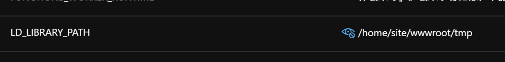

# azure-functions-python-opencv-example
This is **unofficial** sample project of Azure Functions for python with OpenCV

  1. Install and run docker daemon
  1. Clone this repository and open this by VScode with Azure Functions extension.
  1. Edit `HttpTrigger/__init__.py` if you want
  1. Deploy to your Function App (Linux and Consumption plan) using Azure Functions extensions.<br>
     <br>
     or<br>
     <br>
     This step includes the process which downloads the libraies to `./lib` (see [this](./utils/)) <br>
     <br>
     **Note:**<br>
     If you want to deploy it with `--build-native` option, please try to execute `functions-core-tools` directly after executing `./utils/retrieve_so.sh` or `.\utils\retrieve_so.bat`.
  1. Before merging this [PR](https://github.com/Azure/azure-functions-docker/pull/170) and publishing the container image,<br>
     confirm your code if the libraries are loaded before importing like the following.<br>

     ```py
     # In order to use `import cv2`, necessary libraries need to be loaded by following code  before the importing.
     import ctypes
     exlibpath = os.path.dirname(os.path.dirname(os.path.abspath(__file__))) + '/lib/'
     # exlibpath = '/home/site/wwwroot/lib/'
     ctypes.CDLL(exlibpath + 'libglib-2.0.so.0')
     ctypes.CDLL(exlibpath + 'libgthread-2.0.so.0')

     import cv2
     ```

     After merging the PR, you will not need above code, just setting the path including the SO libraries (i.e. `/home/site/wwwroot/lib` ) to App Setting `LD_LIBRARY_PATH`.<br>
     

The http trigger function can comvert image, which is specified by `image_url` query parameter, to grayscale image using `cv2.imread`, `cv2.cvtColor` and `cv2.imwrite`

|Input|Output|
| - | -|
|||
